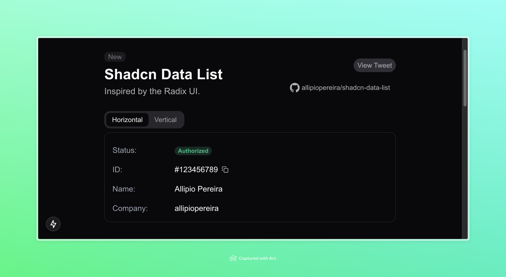

<p align="center">

</p>

# Shadcn data-list
Inspired by the Radix UI.

Try now: https://shadcn-data-list.vercel.app

A flexible component to display data in horizontal and vertical layouts. Designed to be easily integrated into projects based on **shadcn**.

## Shadcn CLI Support

You can now add the `shadcn-data-list` directly via the shadcn CLI! 🎉

### How to use

Run the following command in the shadcn CLI:

```bash
npx shadcn add https://shadcn-data-list.vercel.app/api/r/data-list
```